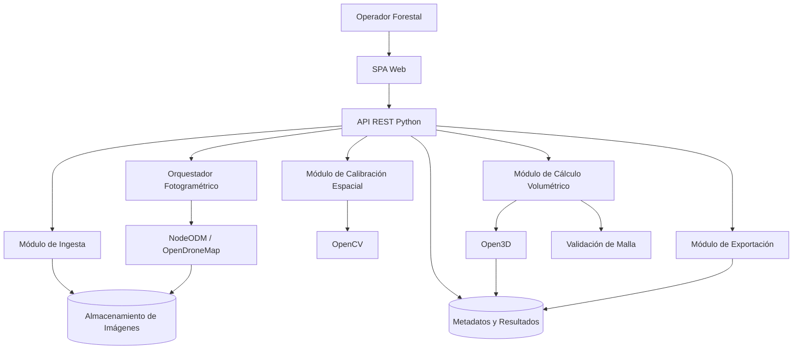
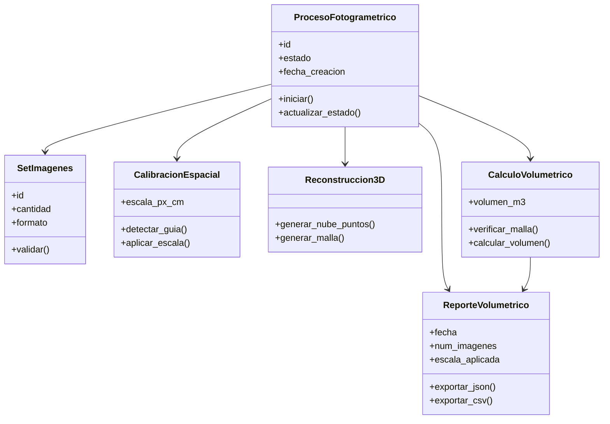

# Vista Lógica

## Descripción general
La vista lógica propone una arquitectura en capas, centrada en un backend en Python que orquesta el flujo fotogramétrico y expone una API REST para una interfaz web desacoplada. La solución se organiza alrededor del ciclo funcional documentado: ingesta de imágenes, calibración espacial, reconstrucción 3D, cálculo volumétrico, visualización y exportación.

## Capas del sistema
- Presentación: interfaz web SPA para carga, seguimiento, visualización 3D y exportación.
- Aplicación: orquestación de casos de uso, validaciones y coordinación del pipeline.
- Dominio: reglas de negocio del volumen, escala espacial, consistencia de mallas y metadatos.
- Infraestructura: integración con OpenCV, NodeODM/OpenDroneMap, Open3D, almacenamiento y persistencia.

## Módulos principales
- Ingesta de imágenes: recibe archivos JPG/PNG y valida formato.
- Calibración espacial: detecta la guía física de 50x50 cm y obtiene la escala.
- Procesamiento fotogramétrico: envía el set de imágenes a NodeODM para generar nube de puntos y malla.
- Cálculo volumétrico: valida la malla y calcula el volumen aparente en m3.
- Visualización web: renderiza el modelo 3D y presenta métricas.
- Exportación: genera reportes JSON y CSV con resultados y metadatos.

## Entidades relevantes
- Set de imágenes: conjunto de fotos asociadas a un proceso.
- Guía de calibración: referencia física utilizada para escalar el modelo.
- Proceso fotogramétrico: ejecución completa con estado, tiempos y artefactos.
- Nube de puntos: resultado intermedio de reconstrucción 3D.
- Malla 3D: representación cerrada usada para el cálculo volumétrico.
- Reporte volumétrico: resultado final exportable.

## Relaciones entre componentes
- La interfaz web invoca la API del backend para cargar imágenes y consultar estados.
- El backend valida archivos y persiste metadatos antes de iniciar el procesamiento pesado.
- El módulo de calibración alimenta la escala al cálculo volumétrico.
- NodeODM genera artefactos 3D que luego son consumidos por Open3D.
- El módulo de exportación reutiliza los metadatos y el resultado calculado.

## Diagrama de componentes

## Diagrama de clases de alto nivel

## Observaciones de diseño
La solución evita acoplar la visualización al motor analítico y concentra la lógica pesada en el backend. Esta separación responde directamente a los requisitos de desacoplamiento, portabilidad y ejecución en CPU sin depender de hardware CUDA.
