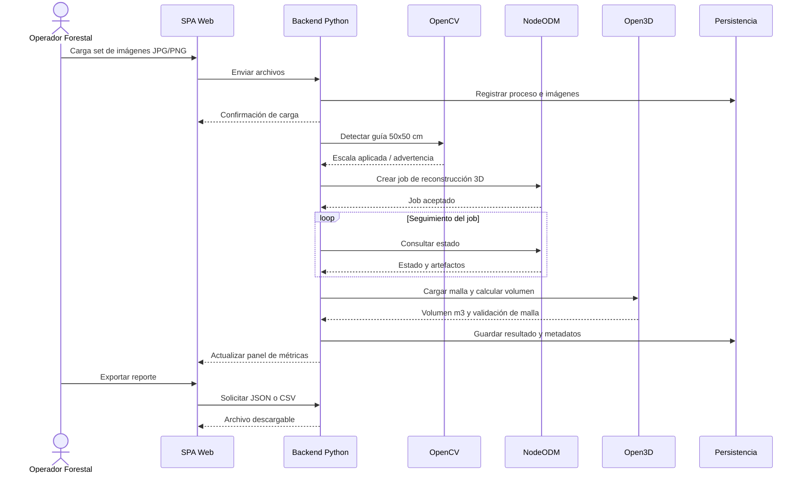
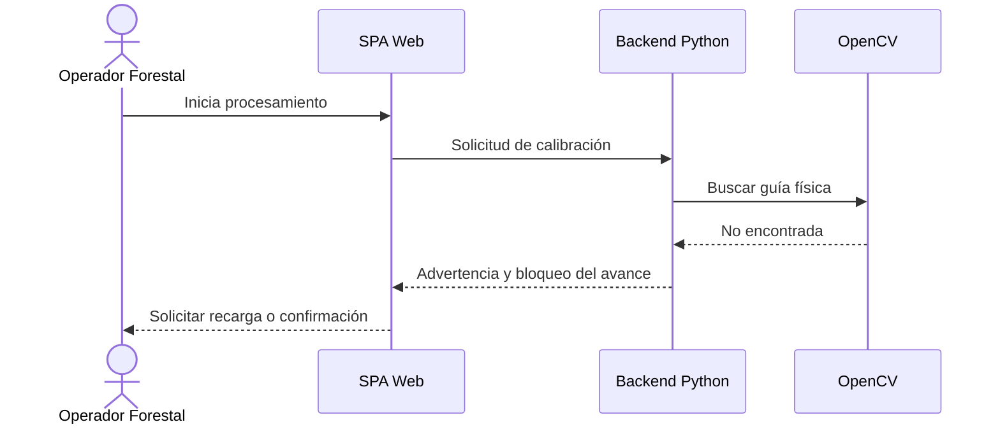
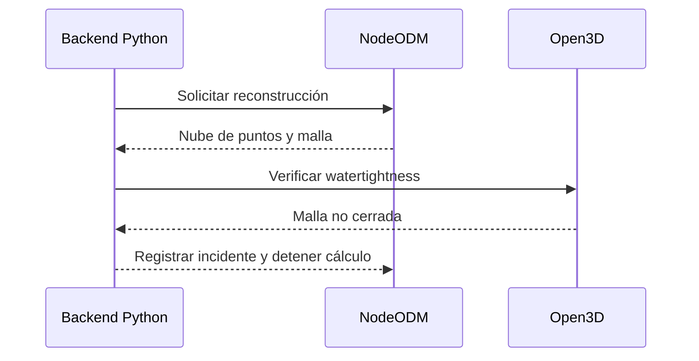

# Vista de Procesos

## Descripción general
La vista de procesos modela el comportamiento dinámico del sistema. El flujo principal es predominantemente secuencial, pero el procesamiento fotogramétrico se trata como una operación larga y asíncrona sobre un motor externo, con actualizaciones de estado al backend y a la interfaz.

## Procesos críticos
- Carga y validación de imágenes.
- Detección de la guía física y cálculo de escala.
- Envío del set a NodeODM para reconstrucción 3D.
- Verificación de integridad de la malla y cálculo volumétrico.
- Generación de métricas y exportación de reportes.

## Flujo principal end-to-end

## Sincronía y asincronía
- Síncrono: carga de archivos, validación de formato, consulta de resultados, exportación.
- Asíncrono: reconstrucción fotogramétrica en NodeODM y actualización progresiva del estado del proceso.

## Eventos importantes
- Archivo rechazado por formato inválido.
- Guía no detectada en el set de imágenes.
- NodeODM no responde o falla el job.
- Malla no estanca y requiere reparación o aborta el cálculo.
- Resultado volumétrico calculado y disponible.

## Manejo transaccional
La unidad transaccional principal es el proceso fotogramétrico completo. El backend debe persistir estados intermedios para permitir reintentos y auditoría del resultado. Los artefactos 3D se tratan como salidas derivadas del job, no como datos editables manualmente.

## Secuencia de excepción: guía no detectada

## Secuencia de excepción: malla defectuosa

## Observaciones de diseño
El sistema debe tolerar fallas parciales y conservar trazabilidad de estados. Esto es importante porque los requisitos aceptan la detección tardía de errores en calibración, topología de malla y conectividad del motor de fotogrametría.
