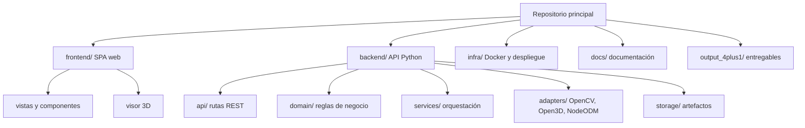

# Vista de Desarrollo

## Descripción general
La organización de desarrollo recomendada es un monorrepo con separación clara entre frontend, backend, infraestructura y documentación. Esta decisión simplifica la trazabilidad de la solución y mantiene alineadas las capas funcionales con los casos de uso documentados.

## Estructura lógica propuesta

## Organización de carpetas
- frontend/: SPA web con componentes de carga, progreso, visor 3D y exportación.
- backend/: API REST en Python con orquestación del flujo y lógica de negocio.
- infra/: definición de contenedores, variables de entorno y despliegue.
- docs/: especificación, análisis y documentación de apoyo.
- storage/: imágenes originales, artefactos intermedios y reportes generados.

## Separación frontend/backend
La interfaz no debe ejecutar procesamiento pesado ni conocer detalles internos de los algoritmos. Solo consume la API REST, lo que cumple el requisito de desacoplamiento y facilita futuras sustituciones del motor de procesamiento sin afectar la experiencia del usuario.

## Módulos o servicios
- Servicio de ingesta y validación.
- Servicio de calibración espacial.
- Servicio de orquestación fotogramétrica.
- Servicio de cálculo volumétrico.
- Servicio de exportación y consulta de resultados.

## Dependencias principales
- Python 3.x como lenguaje de orquestación.
- OpenCV para detección determinista de la guía física.
- NodeODM/OpenDroneMap como motor fotogramétrico.
- Open3D y, opcionalmente, Trimesh para análisis geométrico.
- SPA web con Vue.js o React y Three.js para visualización 3D.

## API y organización de repositorios
- API REST para iniciar procesos, consultar estados, obtener resultados y descargar exportaciones.
- Un único repositorio facilita coordinación entre frontend, backend e infraestructura.
- El backend debe exponer contratos estables para que la UI pueda evolucionar de forma independiente.

## Estrategia de desarrollo
- Implementar primero el flujo mínimo end-to-end: carga, calibración, reconstrucción, cálculo y exportación.
- Aislar el motor fotogramétrico en contenedores para reproducibilidad.
- Validar cada módulo con datos reales de terreno y la guía física de 50x50 cm.
- Mantener el código de visualización separado del pipeline analítico para reducir el acoplamiento.

## Observaciones de diseño
La estructura propuesta prioriza mantenibilidad y reproducibilidad. El monorrepo evita dispersar artefactos tempranos de análisis, mientras que la separación por módulos preserva el crecimiento futuro del sistema.
