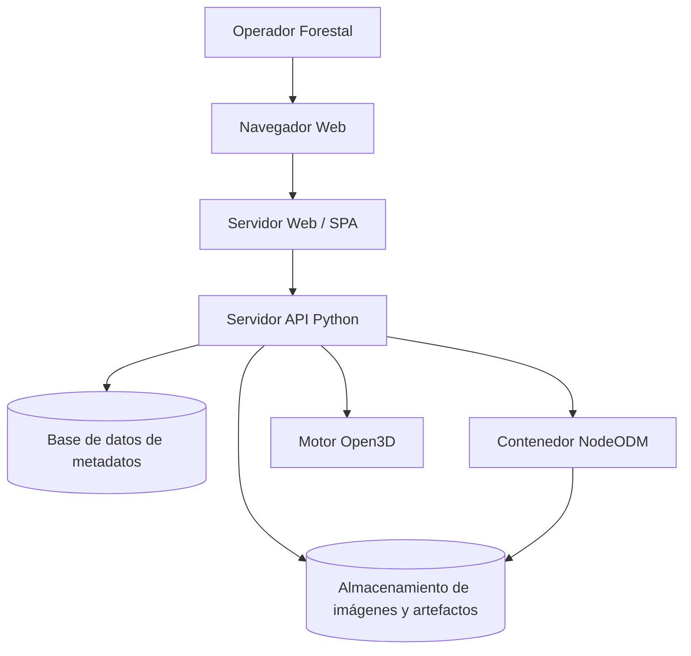
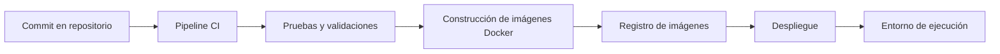

# Vista Física

## Descripción general
La vista física propone un despliegue simple y portátil, consistente con la evidencia documental: una interfaz web, un backend en Python, un motor fotogramétrico en contenedor y almacenamiento local o persistente para imágenes y resultados.

## Infraestructura propuesta

## Servidores y contenedores
- Servidor web para servir la SPA y consumir la API.
- Servidor de aplicación para el backend en Python.
- Contenedor Docker para NodeODM/OpenDroneMap.
- Contenedor o servicio para persistencia de metadatos.
- Volúmenes para guardar imágenes, nubes de puntos, mallas y exportaciones.

## Bases de datos y almacenamiento
- Base de datos de metadatos para procesos, estados, métricas y referencias de exportación.
- Almacenamiento de archivos para imágenes originales y artefactos 3D.
- El diseño debe permitir recuperación de resultados por proceso y auditoría básica.

## Servicios externos
- No se asumen dependencias cloud obligatorias.
- El sistema debe operar con el motor fotogramétrico desplegado localmente en contenedores.
- La interfaz 3D se apoya en librerías de renderizado web, no en servicios externos privativos.

## Networking básico
- Comunicación del navegador con la API por HTTP/HTTPS.
- Comunicación interna entre backend y NodeODM mediante red local o de contenedores.
- Acceso controlado a puertos expuestos del backend y del visor web.

## CI/CD propuesto

## Consideraciones operativas
- RNF-01 y RNF-03 justifican el uso de contenedores y el procesamiento sobre CPU estándar.
- RNF-06 respalda la separación física entre frontend y backend.
- La infraestructura debe priorizar reproducibilidad antes que escalamiento distribuido complejo.

## Observaciones de diseño
No se propone una nube pública obligatoria ni un clúster distribuido porque la documentación no lo exige. Un despliegue contenedorizado y local es suficiente para validar el sistema en terreno y en laboratorio.
