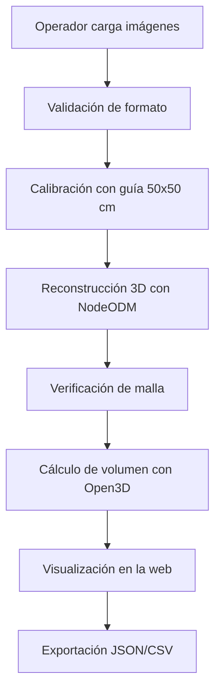

# Vista de Escenarios

## Descripción general
Esta vista resume los recorridos arquitectónicamente relevantes y muestra cómo la solución responde a los requisitos funcionales y no funcionales más críticos. Los escenarios elegidos corresponden a los casos de uso principales documentados.

## Actores principales
- Operador Forestal: carga imágenes, revisa resultados y exporta reportes.
- Sistema: ejecuta la calibración y la automatización interna.

## Escenarios críticos
### Escenario 1: carga y validación de imágenes
- El operador selecciona un conjunto de imágenes JPG/PNG.
- El backend valida formato y registra el set.
- Si existe un archivo inválido, se rechaza sin interrumpir el resto del set válido.

### Escenario 2: calibración espacial con guía física
- El sistema detecta la guía de 50x50 cm.
- Se calcula la escala real y se bloquea el avance si la guía no aparece.
- El resultado de esta etapa condiciona todo el cálculo volumétrico posterior.

### Escenario 3: reconstrucción 3D y cálculo de volumen
- El backend envía el set a NodeODM.
- Se obtiene nube de puntos y malla.
- Open3D calcula el volumen aparente.
- El resultado se persiste y se expone en la UI.

### Escenario 4: exportación y trazabilidad
- El operador descarga JSON o CSV.
- El archivo incluye volumen, fecha, número de imágenes y escala.
- La exportación reutiliza metadatos ya registrados.

## Recorrido end-to-end

## Validación arquitectónica frente a requisitos
- RF-01 y RF-02 quedan cubiertos por la ingesta y validación.
- RF-03, RF-04 y RF-05 quedan cubiertos por la calibración espacial.
- RF-06, RF-07 y RF-08 quedan cubiertos por el motor NodeODM y el flujo de reconstrucción.
- RF-09, RF-10 y RF-11 quedan cubiertos por el cálculo y la exportación.
- RF-12 queda cubierto por la vista web con métricas sincronizadas.
- RNF-01, RNF-03, RNF-04, RNF-05, RNF-06, RNF-07 y RNF-08 quedan alineados con el despliegue propuesto.

## Escenarios arquitectónicamente relevantes
- Falla de formato en la carga.
- Ausencia de guía de calibración.
- Caída temporal del contenedor NodeODM.
- Malla no cerrada o con defectos topológicos.
- Exportación de resultados para control operativo.

## Observaciones de diseño
Los escenarios muestran que la arquitectura favorece la robustez operativa y la trazabilidad. El usuario final nunca necesita manipular el motor fotogramétrico ni los detalles geométricos internos.
